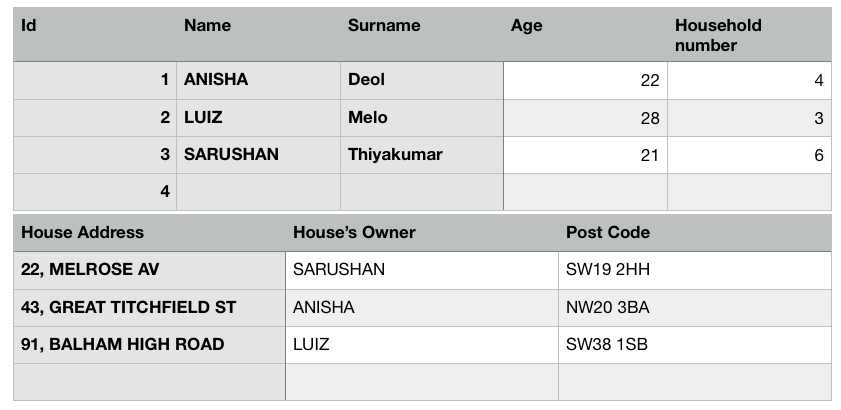

## How to design an API:

### Brief:

We are building a neighbourhood collaboration site and we want to make a system to keep track of people, houses, and addresses of those houses. - Each person has a name, age and number of people in their household - Each house has an address and an owner - Each address has a postcode and street address

The REST API will need to enable users to: - Store people, houses and addresses - Look up a house, it’s address and owner - Look up people in our neighbourhood within certain age brackets and with specific household sizes

## Type of data:

SQL
This is a relational type of database which would work best as you are able to access different columns from different tables and join them together.
Type of Schema:
Column-Orientated Database

- As it is a relational database, using column-orientated would be the best approach. It allows us to store our information in the form of a table with different columns. We wouldn’t need to worry about adding new columns as we would only be updating or deleting information I.e. house owners name, age etc.

## Base URL: https://api.neighbourhood/houseowners

## Routes:

1:
GET (‘/houseowners’)

- this request will get a response of all the house owners data and display on the page successfully with a 200 status.
  Response status: 200
  Content type: application/json
  2:
  POST (‘/houseowners’)
- this request will add a new house owner to the database, responding with 201, which means something has been made successfully.
  Response status: 201.
  Content type: application/json
  3:
  GET (‘/houseowners/owner’)
- this request will return only one specific owner responding with a 200 status, displaying the information on the page successfully.
